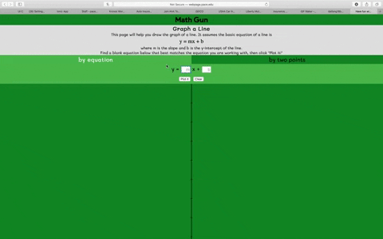
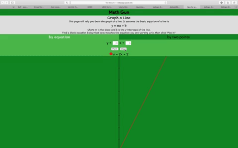

# Math-gun
This project is dedicated to Xiaoxue, my beloved.

Also, welcome everyone to use it.I believe that visualization can help us to feel the Math.  
It currently host under Pace University server by the link below.  
http://webpage.pace.edu/ld17017p/xiaoxue/0.21beta

## Latest Version
### v0.2 

## Screen Shots

## v0.2 updated notes
* add two points draw line
* add tabs
* add colorful line
* add line list
* add auto empty input field

## Introduction
### graph a line
* by equation
* by two points

## Future update plan
* line dot and decoration
* resize coordinate
* draw line by slope and one point

* Quadratic function

## Release milestone
### v0.2 Nov, 19th, 2018
* draw lines by two points
### v0.1-alpha Nov, 7th, 2018
* draw lines by equation

## License
This project is under Apache 2.0 license
